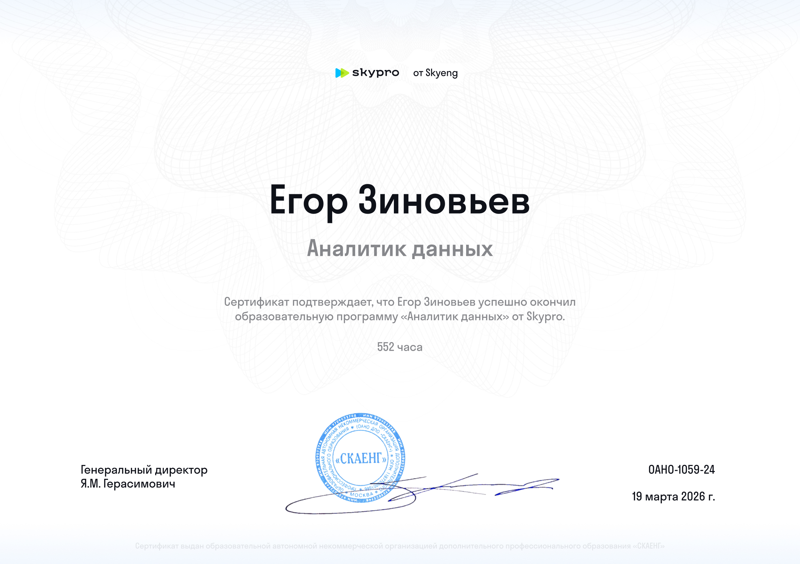

# Мои сертификаты и достижения

---

## 📊 Аналитика данных

### Skypro — «Аналитик данных»
*552 часа. Python, SQL, Excel (Power Query), Google Sheets, A/B-тестирование, когортный анализ, дашборды.*

*Нажмите на изображение для просмотра*

---

## 🏅 Kaggle (в процессе)
<!-- Добавьте ссылки на сертификаты Kaggle, когда получите -->

---

## 🔗 Полезные ссылки
- [Моё портфолио проектов](https://github.com/YegorZinAnalyst)
- [GitHub профиль](https://github.com/YegorZinAnalyst)
